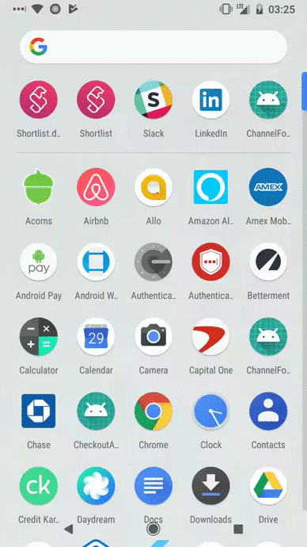

<!-- START doctoc generated TOC please keep comment here to allow auto update -->
<!-- DON'T EDIT THIS SECTION, INSTEAD RE-RUN doctoc TO UPDATE -->
**Table of Contents**  *generated with [DocToc](https://github.com/thlorenz/doctoc)*

- [Channel Four Weather](#channel-four-weather)
  - [Project Quality](#project-quality)
  - [Project Organization](#project-organization)
    - [Android - Android Application Module](#android---android-application-module)
      - [Redux](#redux)
    - [Data - Android Library Module](#data---android-library-module)
    - [Business Logic - Kotlin Module](#business-logic---kotlin-module)
    - [Domain - Kotlin Module](#domain---kotlin-module)
  - [Project Architecture](#project-architecture)
  - [Tests](#tests)
  - [Demo](#demo)

<!-- END doctoc generated TOC please keep comment here to allow auto update -->

# Channel Four Weather

## Project Quality
Channel Four Weather is evaluated by a static analysis / style tool called CodeBeat. The projects  score is available [here](https://codebeat.co/projects/github-com-wrparrish-channelfourweather-master)

## Project Organization
Channel Four Weather is delivered as a multi-module project, in order to establish a clear separation of concerns from an architectural standpoint, as well as leveraging the compile time benefits offered by incremental compilation and its associated optimizations.

The Modules are as follows

* Android
* Data
* Business Logic
* Domain

A module just for the presentation layer was  out of scope for this task.

### Android - Android Application Module
This module  is a "delivery mechanism", it contains the necessary concrete implementations of the more abstract policies of the higher level modules.  It is responsible for creating the dependency graph,  which allows the use cases from the business logic layer to be able to be used, but through inversion of control we still maintain the isolation of the domain and business logic modules. Since there is no separate module for presentation, the Model in our traditional  MVP setup also serves as a Redux Store.
#### Redux
Redux is a way to manage the synchronization of  application state, and a user interface. It has a small and simple api, and a rich set of middleware that can be plugged in to accomplish various tasks. This implementation of it is in kotlin,  but the [documentation](http://redux.js.org/docs/introduction/ThreePrinciples.html) still provides a great overview.

### Data - Android Library Module
This module provides the concrete implementations of the higher level "data source"  policies established by the business logic layer. It can be compiled and consumed as an android library  / .aar.  In a larger project, this would  also contain mapping classes from the data models to domain models, but that was out of scope of this task.  This mapping is generally useful, as changes to the more volatile network dependent models, can be addressed in one location, rather than sprinkled throughout the code.

### Business Logic - Kotlin Module
This module is a pure kotlin module,  with no android knowledge or dependencies.  It establishes a use case interface as the foundation of defining the functionality the app can achieve. It also establishes interfaces for data sources which adhere to a common CRUD interface.  These datasources are also able to be extended and typed to various domain models.  The use cases themselves only depend on these abstractions  / interfaces.  When the dependency graph is created,  concrete implementations of these interfaces are provided by the data module. However, the business logic module is unaffected if the data module changes persistence strategies, or network clients.

### Domain - Kotlin Module
This module is a pure kotlin module,  with no dependencies other than the kotlin std lib / runtime.  It establishes basic data structures that match the expected modeling of the problem space ( in this case, showing the weather, they generated from the json server response of the weathermap api).  In this application all of those structures are nullable,  but a more robust application with a mapping system in the data layer,  could easily rely on that scaffolding to provide default values across the board,  and  relieve alot of the compile time null checks that currently exist in the android module.

## Project Architecture
This project adheres to the principles of [Clean Architecture](https://8thlight.com/blog/uncle-bob/2012/08/13/the-clean-architecture.html)  where possible (for the sake of time).  Layers are crossed by using RxJava Observables,  which  have a tendency  of decoupling components, as the publish / subscribe mechanism they provide lends well to the idea of 'the component providing the data is not concerned with the details of the consuming component'.

## Tests
Some simple tests covering the interactions with the "WeatherState" managed by redux,  are provided in the Android module and can be ran by using ./gradlew test.
 The android / ui layer was kept relatively dumb,  and simply consumes the state emitted by the redux store,   by doing this we are able to keep important pieces of the app testable via regular jvm unit testing.

## Demo

